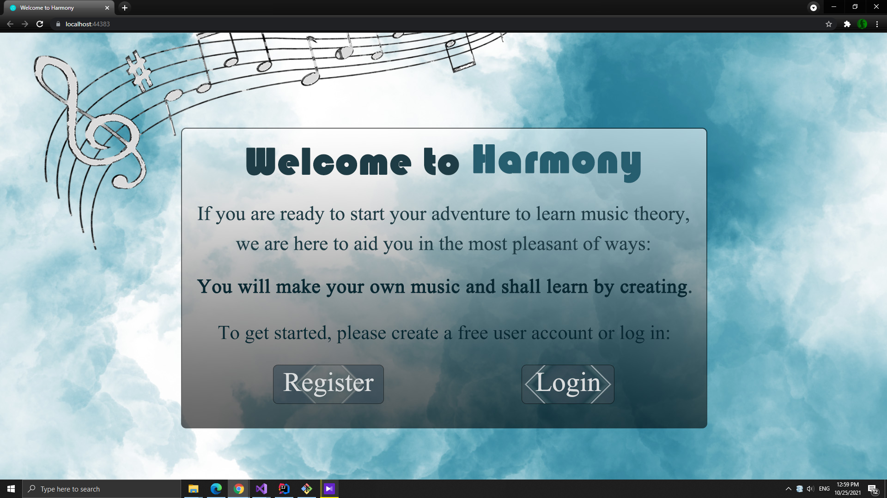
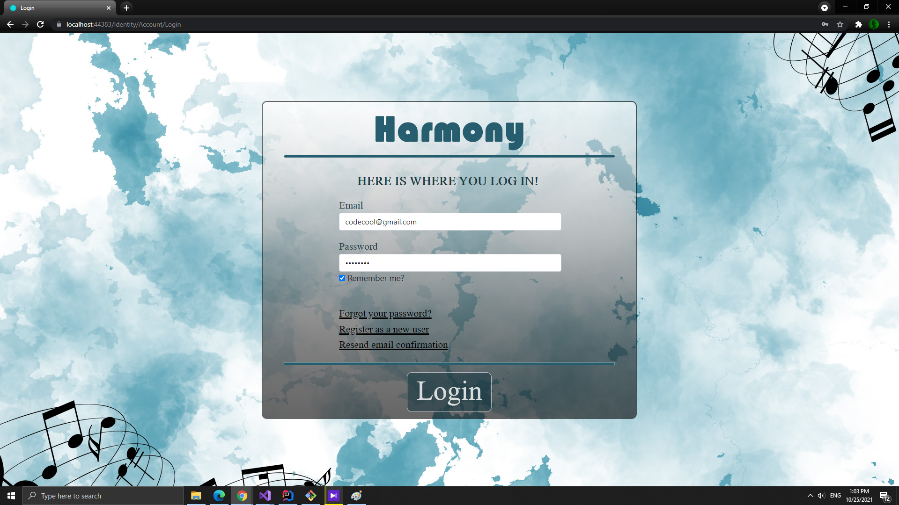
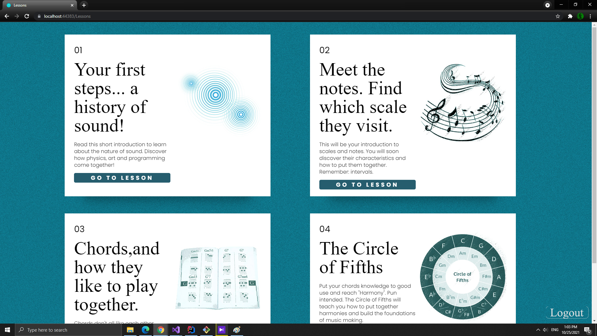
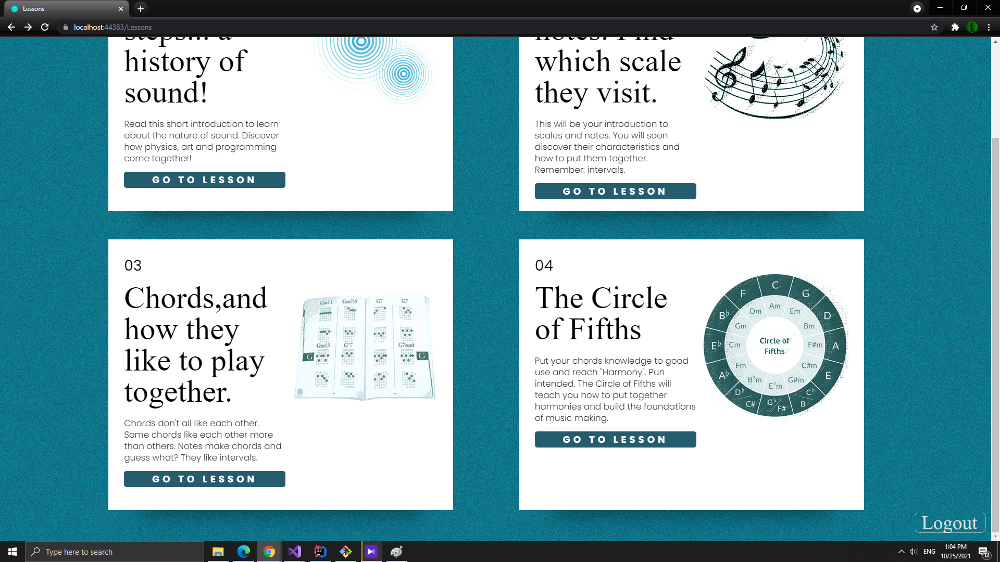
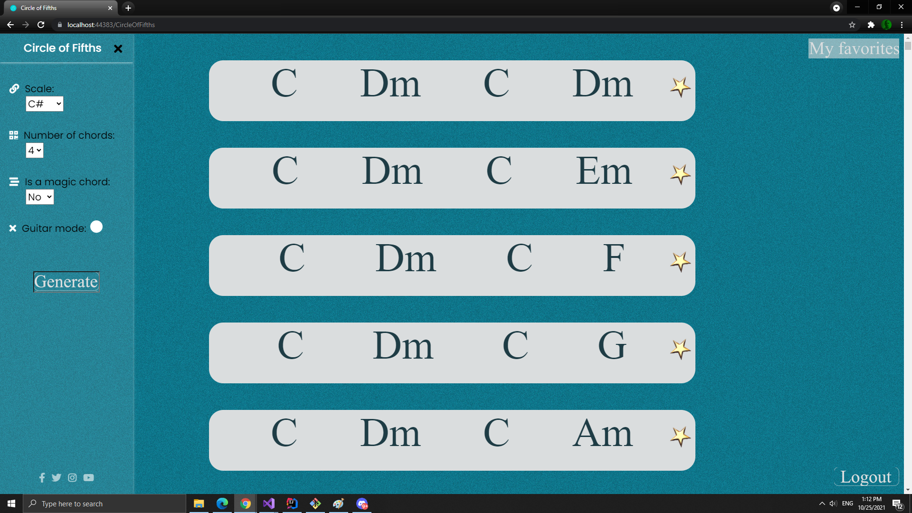
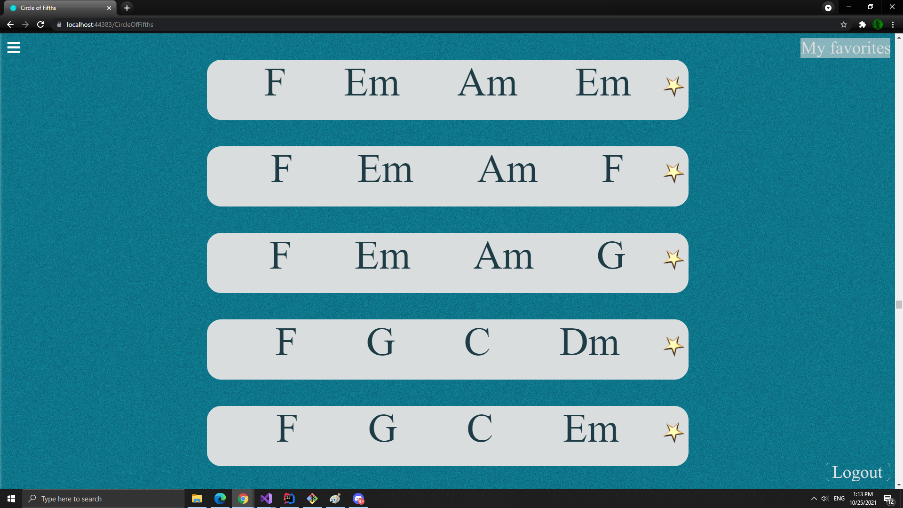
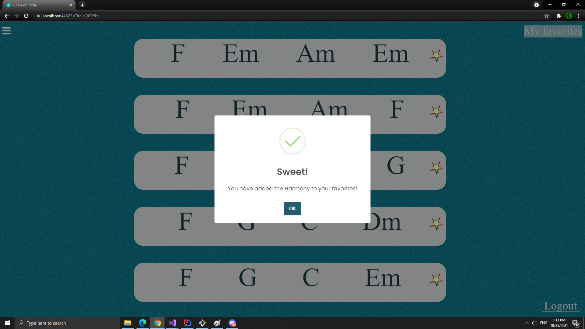

<!--
*** To avoid retyping too much info. Do a search and replace for the following:
*** github_username, repo_name, twitter_handle, email, project_title, project_description
-->


<!-- PROJECT SHIELDS -->
<!--
*** I'm using markdown "reference style" links for readability.
*** Reference links are enclosed in brackets [ ] instead of parentheses ( ).
*** See the bottom of this document for the declaration of the reference variables
*** for contributors-url, forks-url, etc. This is an optional, concise syntax you may use.
*** https://www.markdownguide.org/basic-syntax/#reference-style-links
-->
[![LinkedIn][linkedin-shield]](https://www.linkedin.com/in/stefan-sorea-979a1b182/)


<!-- PROJECT LOGO -->
<br />
<p align="center">

[comment]: <> (  <a href="https://github.com/sunStephan/DungeonCrawler">)

[comment]: <> (    )

[comment]: <> (  </a>)

  <h3 align="center">Harmony</h3>


<!-- TABLE OF CONTENTS -->
<details open="open">
  <summary><h2 style="display: inline-block">Table of Contents</h2></summary>
  <ol>
    <li>
      <a href="#about-the-project">About The Project</a>
      <ul>
        <li><a href="#built-with">Built With</a></li>
      </ul>
    </li>
    <li>
      <a href="#getting-started">Getting Started</a>
      <ul>
        <li><a href="#prerequisites">Prerequisites</a></li>
        <li><a href="#installation">Installation</a></li>
      </ul>
    </li>
    <li><a href="#usage">Usage</a></li>
    <li><a href="#contact">Contact</a></li>
    <li><a href="#acknowledgements">Acknowledgements</a></li>
  </ol>
</details>


<!-- ABOUT THE PROJECT -->
## About The Project

<p align="left">
    <br />
    Harmony is a web app that offers amateurs and experienced musicians alike tools to learn music theory and create musical compositions, to store and share their creations.

   Harmony offers lessons that have 3 components:
1. The first component describes a musical concept. This is the "documentation" part of the lesson.

2. The second component represents a music generator that shows practical usages of the musical theory concept.
3. The third component allows the musician to compose in the frame of an particular lesson, by dragging and dropping musical elements.


<br/>

The project has been built with Microsoft's ASP .NET Core MVC framework and React.

Full list of technologies used:

For the Backend:

* ASP. Net Core HTTP Request Processing Platform, MVC Framework, Identity Framework, Entity Framework,  Microsoft SQL Server

For the Frontend:

* HTML, CSS, JavaScript, Jquery, Bootstrap, Razor Pages, React

<br/>


<span style= "font-size:0.8em; margin-top:-2px">*The project is in development and some features and technologies may not be yet implemented.</span>

</p>


### Built With

* [C#](https://en.wikipedia.org/wiki/C_Sharp_(programming_language))
* [.NET](https://en.wikipedia.org/wiki/.NET)
* [React](https://reactjs.org/)


<!-- GETTING STARTED -->
## Getting Started

To get a local copy up and running follow these simple steps.


### Prerequisites

Any computer belonging to millennia III will work.

### Installation

1. Clone the repo.
   ```sh
   git clone https://github.com/sunStephan/Harmony.git
   ```
    For a guide how to clone a Git Repo press [here](https://docs.github.com/en/github/creating-cloning-and-archiving-repositories/cloning-a-repository-from-github/cloning-a-repository).


2. [Install .Net](https://dotnet.microsoft.com/download).
<br/><br/>   
4. Install an IDE to be able to run the project. As a suggestion, check out Microsoft's free [Visual Studio Community Edition](https://visualstudio.microsoft.com/).


<!-- USAGE EXAMPLES -->
## Usage

You should first register an account and log in




After that, you should choose the lesson that you want to learn




Go along with it !





<!-- LICENSE -->
## License

See `LICENSE` for more information.

<!-- CONTACT -->
## Contact

Șorea Ștefan - [sorea.stefan@gmail.com](sorea.stefan@gmail.com)

Project Link: [https://github.com/sunStephan/Harmony](https://github.com/sunStephan/Harmony.git)


<!-- MARKDOWN LINKS & IMAGES -->
<!-- https://www.markdownguide.org/basic-syntax/#reference-style-links -->
[contributors-shield]: https://img.shields.io/github/contributors/github_username/repo.svg?style=for-the-badge
[contributors-url]: https://github.com/github_username/repo_name/graphs/contributors
[forks-shield]: https://img.shields.io/github/forks/github_username/repo.svg?style=for-the-badge
[forks-url]: https://github.com/github_username/repo_name/network/members
[stars-shield]: https://img.shields.io/github/stars/github_username/repo.svg?style=for-the-badge
[stars-url]: https://github.com/github_username/repo_name/stargazers
[issues-shield]: https://img.shields.io/github/issues/github_username/repo.svg?style=for-the-badge
[issues-url]: https://github.com/github_username/repo_name/issues
[license-shield]: https://img.shields.io/github/license/github_username/repo.svg?style=for-the-badge
[license-url]: https://github.com/github_username/repo_name/blob/master/LICENSE.txt
[linkedin-shield]: https://img.shields.io/badge/-LinkedIn-black.svg?style=for-the-badge&logo=linkedin&colorB=555
[linkedin-url]: https://linkedin.com/in/github_username
